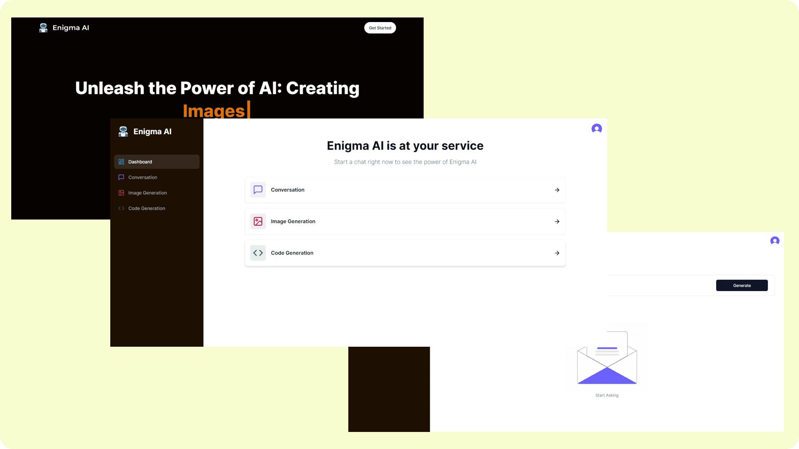

# Enigma AI | A powerfull AI application built using OpenAI's API

A powerfull AI application capable of having conversations and generating code, images, music and videos.

## Screenshot


[LIVE LINK](https://enigma-ai.vercel.app)

Features:

- Tailwind design
- NextJS
- React
- Typescirpt
- Tailwind animations and effects
- Full responsiveness
- Clerk Authentication (Email, Google)
- Client form validation and handling using react-hook-form
- Server error handling using react-toast
- Image Generation Tool (Open AI)
- Video Generation Tool (Replicate AI)
- Conversation Generation Tool (Open AI)
- Music Generation Tool (Replicate AI)
- Page loading state

### Prerequisites

**Node version 18.x.x**

### Cloning the repository


### Install packages

```shell
npm i
```

### Setup .env file


```js
NEXT_PUBLIC_CLERK_PUBLISHABLE_KEY=
CLERK_SECRET_KEY=

NEXT_PUBLIC_CLERK_SIGN_IN_URL=/sign-in
NEXT_PUBLIC_CLERK_SIGN_UP_URL=/sign-up
NEXT_PUBLIC_CLERK_AFTER_SIGN_IN_URL=/dashboard
NEXT_PUBLIC_CLERK_AFTER_SIGN_UP_URL=/dashboard

OPENAI_API_KEY=
REPLICATE_API_TOKEN=

NEXT_PUBLIC_APP_URL="http://localhost:3000"

```
### Start the app

```shell
npm run dev
```

## Available commands

Running commands with npm `npm run [command]`

| command         | description                              |
| :-------------- | :--------------------------------------- |
| `dev`           | Starts a development instance of the app |